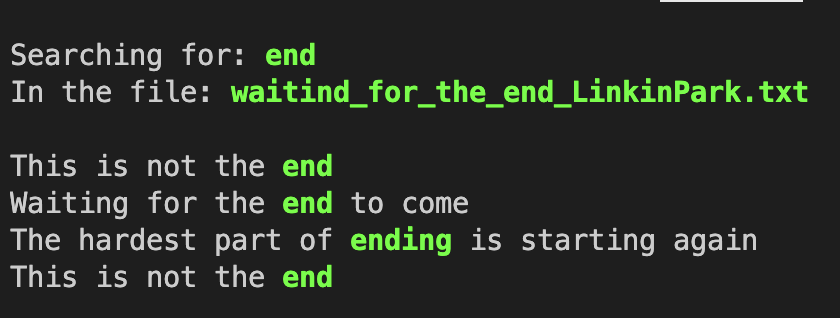
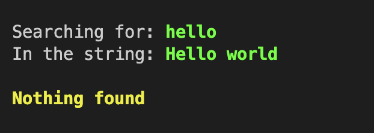
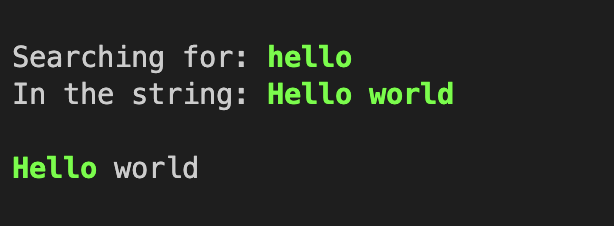

## Small console Grep with findings highlighting written on rust

## Installation

Download source code from github: 

`git clone https://github.com/lnB51/rust_grep`

Run the project using Cargo:

`cargo run [word for searching] [options] [target]`

 

### Paremeters:

#### [word for searching]

##### Any word for search in `[target]`, for search string use `"string for search"`

#### Exaples:
`cargo run hello [options] [target]`
`cargo run "hello world" [options] [target]`

#### [options]

##### Option for search(search type), currently available parameters: `-f` for searching in a file and `-s` for searching in a string.

#### Exaples:
`cargo run hello -f myfile.txt`
`cargo run hello -s "Hello world"`

#### [target]

##### Target for searching in, if selected `[option]` is `-f` - taget must be a file, if selected `[option]` is `-s` - must be a string.

#### Exaples:
`cargo run hello -f myfile.txt`
`cargo run hello -s "Hello world, searching method in string"`

 

### Searching case sensitivity can be changed by adding `CASE_INSENSITIVE=true` to your terminal env.

#### Case sensitive mode: `cargo run hello -s "Hello"` -> `Nothing found`
#### Case insensitive mode: `cargo run hello -s "Hello world"` -> `Hello` world

 

### Examples:

#### Case insensitive in file:

#### Case sensitive in string:

#### Case insensitive in string:

